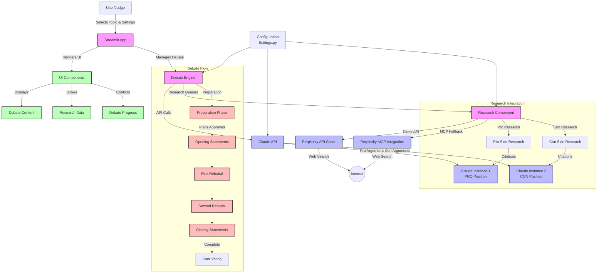

# Claude vs Claude Debate System

A minimal Streamlit application that hosts a debate between two instances of Claude, arguing opposite sides of a topic with human judge evaluation.

> *This project was conceived and implemented in two hours at the [First Ever
> Claude Speedrun Hackathon @ Berkeley](https://lu.ma/4zxa9ash?tk=N05F0U)*

## DEMO LINKS

- [YouTube 7 Minutes](https://youtu.be/avVqaOqdVIo)
- [DevPost Submission](https://devpost.com/software/claude-vs-claude-ultimate-debate-system)

## Features

- Select from predefined debate topics or create your own
- Watch two Claude instances debate opposite sides of an issue
- Control debate progression with a turn-based system
- Vote for the debater you thought presented better arguments
- Simple and intuitive UI built with Streamlit
- Real-time research capabilities using Perplexity Sonar API
- Citation support for factual claims in debates

## System Architecture



## Getting Started

### Prerequisites

- Python 3.8+
- Anthropic API key
- Perplexity Sonar API key (optional, for research capabilities)

### Installation

1. Clone the repository

```bash
git clone https://github.com/yourusername/claude-debate.git
cd claude-debate
```

2. Create a virtual environment

```bash
python -m venv venv
source venv/bin/activate  # On Windows: venv\Scripts\activate
```

3. Install dependencies

```bash
pip install -r requirements.txt
```

4. Set up your environment variables

```bash
cp .env.example .env
```

Then edit `.env` to add your Anthropic API key and Perplexity API key (if using research features).

### Running the App

```bash
streamlit run app.py
```

The app will be available at <http://localhost:8501>

## Project Structure

```
/claude-debate/
├── app.py                   # Main Streamlit entry point
├── requirements.txt         # Project dependencies
├── .env.example             # Example environment variables
├── .gitignore               # Git ignore file
├── modules/
│   ├── claude_api.py        # Claude API wrapper
│   └── debate_engine.py     # Core debate logic
├── ui/
│   └── components.py        # UI components
└── config/
    └── settings.py          # App settings and configurations
```

## Branching Strategy

The project uses the following branching strategy for collaborative development:

- `main`: Production-ready code
- `develop`: Integration branch for features
- Feature branches: Individual components (branched from `develop`)

## Contributing

1. Create a feature branch from `develop`
2. Implement your changes
3. Submit a pull request to merge back into `develop`
4. After testing and review, changes will be merged into `main`

## License

This project is licensed under the MIT License - see the LICENSE file for details.

