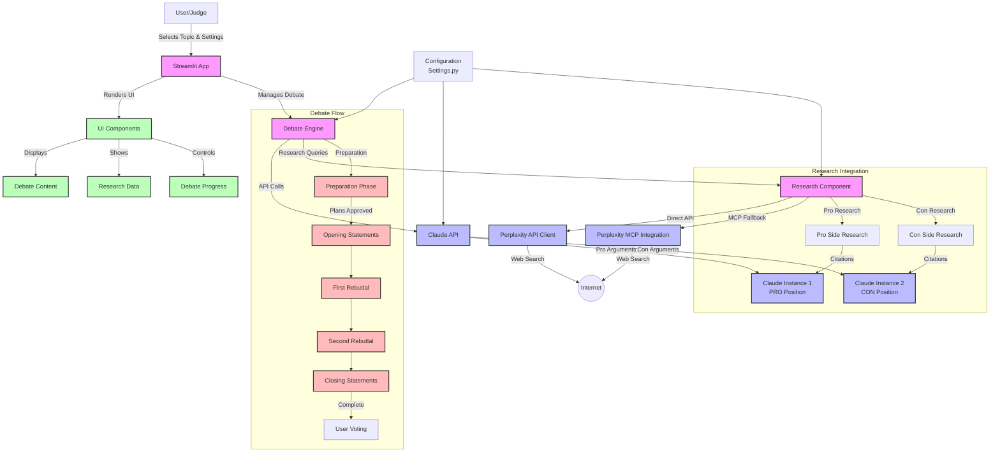

# Claude vs Claude Debate System

A minimal Streamlit application that hosts a debate between two instances of Claude, arguing opposite sides of a topic with human judge evaluation.

> *This project was conceived and implemented in two hours at the [First Ever
> Claude Speedrun Hackathon @ Berkeley](https://lu.ma/4zxa9ash?tk=N05F0U)*

## DEMO LINKS

- [YouTube 7 Minutes](https://youtu.be/avVqaOqdVIo)
- [DevPost Submission](https://devpost.com/software/claude-vs-claude-ultimate-debate-system)

## Features

- Select from predefined debate topics or create your own
- Watch two Claude instances debate opposite sides of an issue
- Control debate progression with a turn-based system
- Vote for the debater you thought presented better arguments
- Simple and intuitive UI built with Streamlit
- Real-time research capabilities using Perplexity Sonar API
- Citation support for factual claims in debates

## System Architecture



## Getting Started

### Prerequisites

- Python 3.8+
- Anthropic API key
- Perplexity Sonar API key (optional, for research capabilities)

### Installation

1. Clone the repository

```bash
git clone https://github.com/yourusername/claude-debate.git
cd claude-debate
```

2. Create a virtual environment

```bash
python -m venv venv
source venv/bin/activate  # On Windows: venv\Scripts\activate
```

3. Install dependencies

```bash
pip install -r requirements.txt
```

4. Set up your environment variables

```bash
cp .env.example .env
```

Then edit `.env` to add your Anthropic API key and Perplexity API key (if using research features).

### Running the App

```bash
streamlit run app.py
```

The app will be available at <http://localhost:8501>

## Project Structure

```
/claude-debate/
├── app.py                   # Main Streamlit entry point
├── requirements.txt         # Project dependencies
├── .env.example             # Example environment variables
├── .gitignore               # Git ignore file
├── modules/
│   ├── claude_api.py        # Claude API wrapper
│   └── debate_engine.py     # Core debate logic
├── ui/
│   └── components.py        # UI components
└── config/
    └── settings.py          # App settings and configurations
```

## Branching Strategy

The project uses the following branching strategy for collaborative development:

- `main`: Production-ready code
- `develop`: Integration branch for features
- Feature branches: Individual components (branched from `develop`)

## Contributing

1. Create a feature branch from `develop`
2. Implement your changes
3. Submit a pull request to merge back into `develop`
4. After testing and review, changes will be merged into `main`

---

## A Vision for Deep Applications - Distillation, Post-training, Alignment, and Safety Research

The Claude vs Claude Debate System can be more than just a demo application, offering potential for advancing AI research across multiple critical domains. By creating structured, argumentative discourse between AI systems with traceable reasoning paths, this framework provides capabilities for studying and improving existing and frontier AI systems.

### Knowledge Distillation and Model Compression

The debate format provides a powerful mechanism for knowledge distillation:

1. **Cross-model Distillation**: Debates between different model versions (e.g., Claude-3-Sonnet vs Claude-3-Opus) can identify where the larger model's superior reasoning appears, allowing targeted capture of these capabilities.

2. **Synthetic Data Generation**: Debate transcripts create a rich corpus of high-quality reasoning chains with built-in critique and improvement cycles. This synthetic data can train smaller, specialized models that retain sophisticated reasoning capabilities at a fraction of the computational cost.

3. **Reasoning Template Extraction**: The stage-based progression (preparation, opening, rebuttals, closing) provides explicit templates for different phases of analytical thinking that can be distilled into more compact models.

### Post-training and Supervised Fine-tuning

The debate framework offers unique advantages for post-training:

1. **Adversarial Improvement**: By having models critique each other, the system naturally identifies weaknesses in reasoning, creating a targeted dataset of "hard cases" for fine-tuning.

2. **Factuality Enhancement**: The research integration with Perplexity creates a powerful mechanism for generating training data that couples claims with citations, teaching models to ground assertions in verifiable sources.

3. **Multi-step Reasoning**: Debates naturally involve complex chains of reasoning with rebuttals addressing potential flaws, creating ideal training examples of thorough multi-step reasoning processes.

4. **Balance Calibration**: Exposure to multiple perspectives on contentious topics helps calibrate models to recognize the legitimate arguments on different sides, improving epistemological humility.

### Alignment and Safety Research

Perhaps the most promising applications are in alignment and safety:

1. **Value Pluralism Exploration**: Debates on complex ethical and philosophical ideas can map out different value systems and how they interact, helping researchers understand how models reason about normative questions.

2. **Deception Detection**: Debates with strategic incentives can reveal how models might attempt to persuade through subtle rhetorical tactics rather than honest reasoning, allowing researchers to identify and mitigate such behaviors.

3. **Red-teaming Through Opposition**: By setting up debates on sensitive topics, researchers can observe how models formulate arguments that might be concerning from a safety perspective, even when not explicitly prompted to produce harmful content.

4. **Preference Learning**: Human judging of debates can provide rich signals about what constitutes high-quality reasoning from a human perspective, offering nuanced feedback data for aligning models with human values.

5. **Constitutional Principles Testing**: Debates can test how models apply constitutional principles  or axiomatic thinking when arguing for positions that might test emotional boundaries, revealing edge cases and ambiguities in [constitutional AI approaches](https://www.anthropic.com/research/constitutional-ai-harmlessness-from-ai-feedback).

### Research Data Collection and Analysis

The system architecture enables sophisticated data collection:

1. **Fine-grained Instrumentation**: Each debate generates structured, stage-specific data on model outputs, enabling detailed analysis of reasoning patterns across different topics and debate phases.

2. **Comparative Evaluation**: Direct comparison between positions on the same topic can facilitate nuanced evaluation of model capabilities, going beyond simple benchmarks.

3. **Human Feedback Integration**: The voting mechanism at the tail end of the workflow provides a natural channel for human feedback, creating a reinforcement learning from human feedback (RLHF) pipeline for model improvement.

4. **Longitudinal Studies**: Running debates with model versions over time enables tracking of capability evolution and alignment drift on consistent scenarios.

### Future Research Integrations

To fully realize this vision, several research-oriented features can and will be implemented:

1. **Stretch Goal for Labs - Model Trace Visualization**: Adding tools to visualize attention patterns and activation values during key reasoning steps, especially when models change their stance or concede points.

2. **Automated Logical Analysis**: Implementing formal verification of argument structures to identify fallacies, contradictions, and strong inferential patterns.

3. **Similar to LLMArena: Multi-model Tournaments**: Expanding beyond Claude to create tournaments between different models (Claude, GPT, Gemini, etc.) to identify relative strengths in reasoning domains.

4. **Interaction Structures - Specialized Debate Formats**: Implementing structured debate formats like the Gricean Scorecard or Bayesian updating frameworks that enforce particular reasoning norms.

5. **Cognitive Science Research**: Partnering with cognitive scientists to compare AI debate behaviors with human debate patterns, identifying areas where alignment diverges from human reasoning.

By developing these capabilities, the Claude vs Claude Debate System could evolve from just another demonstration to a critical research infrastructure for advancing our understanding and improvement of AI systems through dialectical methods.

## License

This project is licensed under the MIT License - see the LICENSE file for details.
